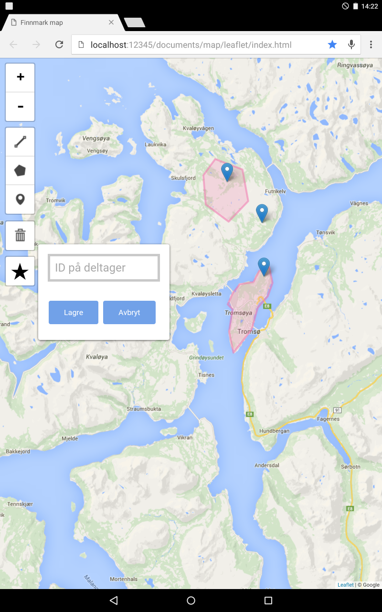

# anth-leaflet-map
A simple map app in Leaflet for participants in field research to annotate (offline) maps. Annotations are saved in [GeoJSON format](http://geojson.org/).



We've been using the app on a Nexus 10 tablet during [our fieldwork](https://pastoralism-climate-change-policy.com/projects/reign/) and it seems to work ok (minus the occasional blip).

For the time being, this software is provided 'as is' and I'm not really in a position to offer support (mainly because I'm in the field). I may well add/remove features to suit our fieldwork and participants, but if you want to suggest new features or report bugs, please feel free.

## Installing and using the app
If you just want to use the app without any faff, you can download a .zip containing the latest version that's more or less ready to go. Once you've unzipped, you'll find the following folder structure:

```
anth-leaflet-map
|-- css
|-- map
|-- js
    \- vendor
```

To run the app (after downloading map tiles), just open `index.html`.

### Downloading map tiles
The main thing we wanted was a map annotation app that works offline. We used [Mobile Atlas Creator](http://mobac.sourceforge.net/). For reasons I forgot to write down, we needed to use version 1.8 rather than the latest release. You can [download it here](http://datamoil.blogspot.no/2011/05/offline-google-maps-on-osmdroid.html).

Save tiles into the `map` folder as .png files.

If you want to use online maps, change `tile_url` on line 39 and see the [Leaflet docs](http://leafletjs.com/reference.html#tilelayer).

### Tweaking `index.html`
You'll need to tell the app where to find the map you want to annotate. For the time being, this involves editing `index.html` directly -- just open it in any text editor.

To use downloaded tiles, you don't need to change much, but you'll need to tell the app what levels of zoom you've downloaded. We've been using zoom levels between 7 and 12, which seems fine for our purposes and allows participants to orient themselves then zoom in to a pretty decent level of detail.

If you want to use different zooms, change these lines in `index.html`:

- line 36: `minZoom: 7`
- line 41: `minZoom: 7`
- line 42: `maxZoom: 12`

Also, remember to change the attribution for the source of the tiles on line 43: `attribution: "&copy; whoever provided your maps"`

## Using the app
Out of the box, users can draw lines and areas, and place markers on maps. 

### Saving annotations
The save button (&starf;) will be enabled after the user draws something on the map. When you click it, a dialog box will appear asking for a filename (we wanted to name the files after interview IDs). Enter one and click the Save button to download the .json file containing annotations. If you don't enter a filename, the app will save annotations using today's date.

## Language localisation
At the moment, the app is localised for our fieldwork in Norway. If you want to tweak them, just edit `leaflet.draw.norsk.js` in the `js` sub-folder. Or if you want to use the default language of English, [comment out](http://www.htmlcodetutorial.com/_33n45n45n.html) line 25 in `index.html`.

The save dialog box also contains some language localisations. You'll find them on lines 104--106.

## Running the app on a smartphone/tablet
To run it on a phone/tablet, you'll also need to install a local web server (I've been using [Simple HTTP Server](https://play.google.com/store/apps/details?id=jp.ubi.common.http.server)). In the future we hope to make a more app-like version of this.

## Making changes
We welcome contributions.

1. Install [Node.js](http://nodejs.org/)
2. Install [Bower](https://bower.io/): `npm install bower`
3. Fork this repository or download the code
4. In the code folder, run `bower install` to get all dependencies

## Tweaks we're working on

- Let users drag markers around if they're in edit mode.
- If user deletes all drawn items, the save button becomes disables (which is good) but then if user clicks cancel to the deletions -- and so the items get restored to the screen -- the save button stays disabled.
- Adding some kind of freehand drawing capability, probably either with [L.Pather](https://github.com/Wildhoney/L.Pather) or [Leaflet.FreeDraw](https://github.com/Wildhoney/Leaflet.FreeDraw). (Neither have good touchscreen support at the moment, though...)
